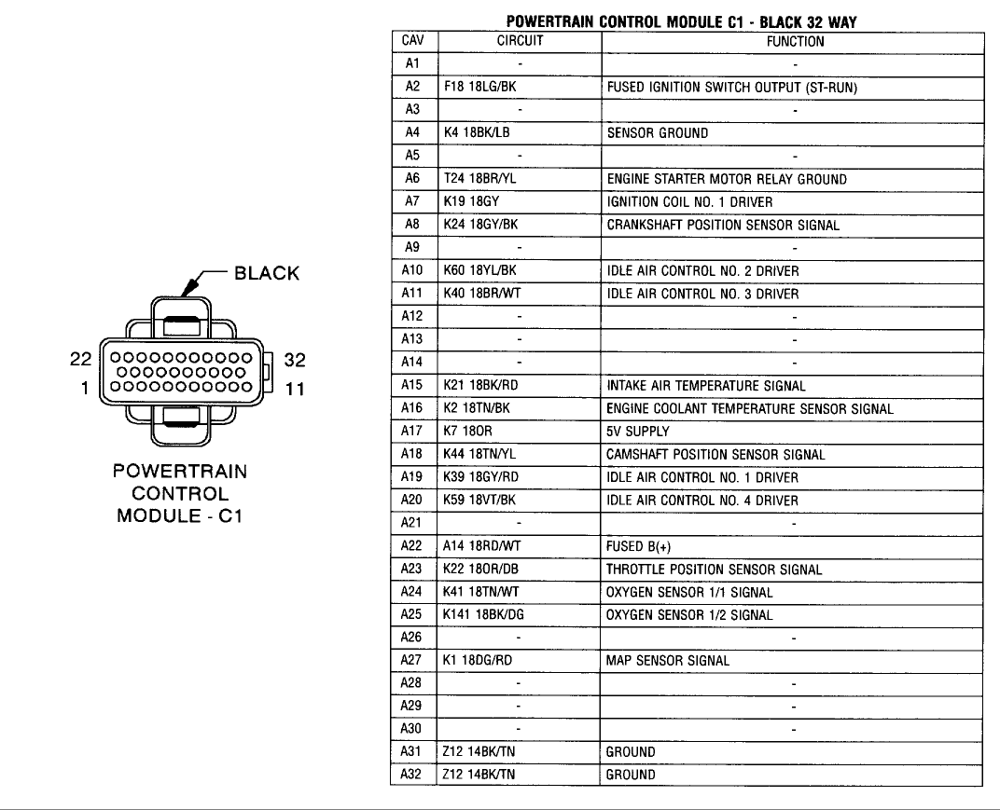
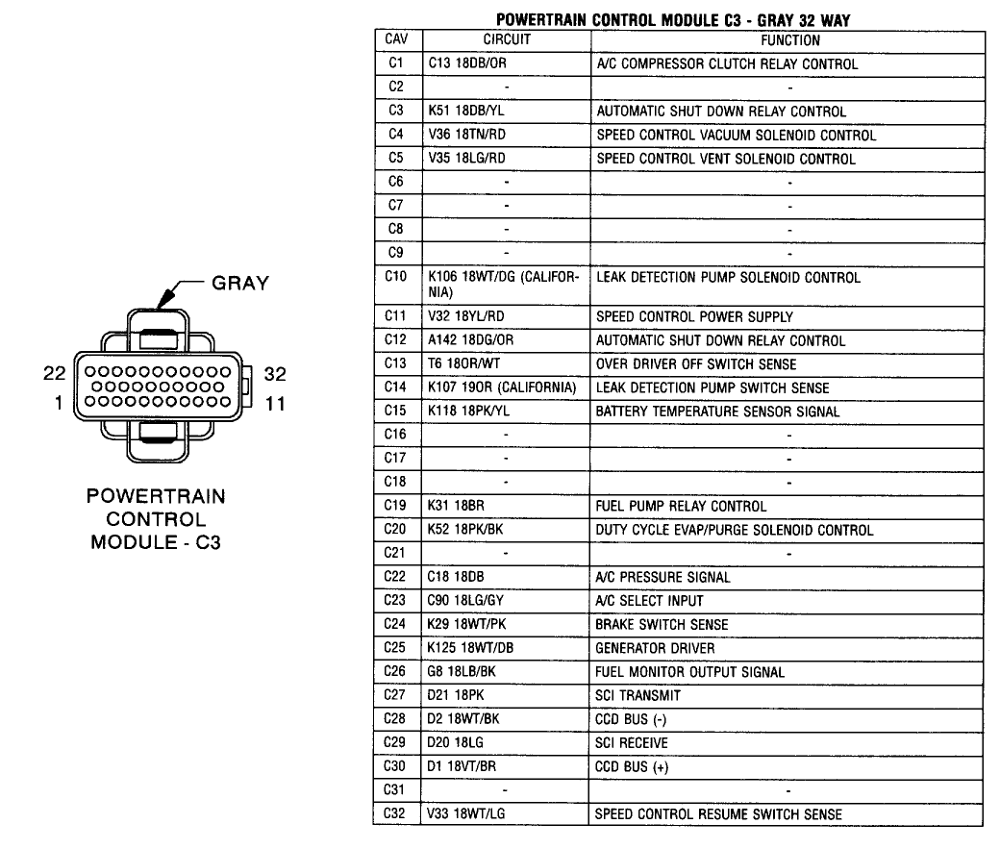

2000 Dodge Ram Van B3500 Maintenance and Repair

August 2025, problem is like [this guy's](https://dodgeforum.com/forum/dodge-ram-van/443024-2000-ram-van-3500-crank-but-won-t-start.html). It was running fine
until the last trip, where on the way home the engine stalled when we had to
stop, but it started right back up both times. However, when we attempted to
start it a day or two after getting home, it doesn't start.

Some differences with Vincent's problems: first, bypassing the ASR[^1] relay by
jumpering pins 3 and 5 of the socket doesn't produce 12V at the DG/OR[^2] wire
of the ignition coil, and I can't see where the wire goes once it runs
behind the alternator.

The code reader, Motopower MP60933, gets the display lit when connected to
the ODB2 receptacle under the steering wheel, but hitting the VIN or ODB key
attempts to communicate with the PCM[^3] and fails every time. I tested it with
a much newer Subaru Outback and it works, and the same model connects to
a Mercury Mountaineer from 2008 or so. So the code reader isn't likely at
fault. Turning the ignition key to "run" 3 times and waiting for the odometer
to flash results in the "no buS" display and the "check engine" light, followed
a minute or so later with the "low fuel" light.

I can't locate the fuel pump relay; it's neither in the engine bay fuse box
nor in the fuse panel behind the driver's door.

The wiring diagram in my Haynes manual shows a dark blue wire going from the
ignition run/start position to the ASR coil, but that's not the case. Instead
a red wire goes to the 30A fusible link marked 11 under the fuse box cover,
and a red wire with white stripe comes out the other side, splits into 2, and
connects to both the coil and common points on the relay. So it doesn't
require the ignition key at all to get voltage at the relay.

I found two of the spark plug connectors not seated properly at the distributor
cap, but that's unlikely to be relevant. Anyway, they're seated now.

So, even if the computer is replaced, I fail to see how it's going to solve the
ignition problem. And if anything is wrong with the fuel system, I have no clue
how to go about fixing it, lacking the location of the relay, and not knowing
for sure where the fuel pump and filter are; however the best info I've found
on YouTube University indicates they're both in the fuel tank, which, full,
weighs on the order of 300 pounds.

I've removed the computer, cleaned the oxidation where it connects to the van,
and reconnected it; no help. Also cleaned and reconnected other ground wires.

Checked the throttle position sensor, with the ignition key in RUN position,
for voltage, which should, according to one of the videos I watched but didn't
note the URL, indicate a (at least partly) function computer.
There were 5VDC at points 1 (OR --- Hayes manual shows VT/WT, and for pin 3,
as it has the pin numbers inverted) and 2 (OR/DB).  Pin 3 (BK/LB) showed no
voltage relative to ground.

Wiring diagram of PCM (computer), with C1 to the right as you're looking at it
from the front of the van:

[^1]: Automatic Shutdown Relay
[^2]: Color codes: DG=dark green; OR=orange; DB=dark blue; BK=black; YL=yellow;
      VT=violet; WT=white
[^3]: Powertrain Control Module, AKA "the computer"
