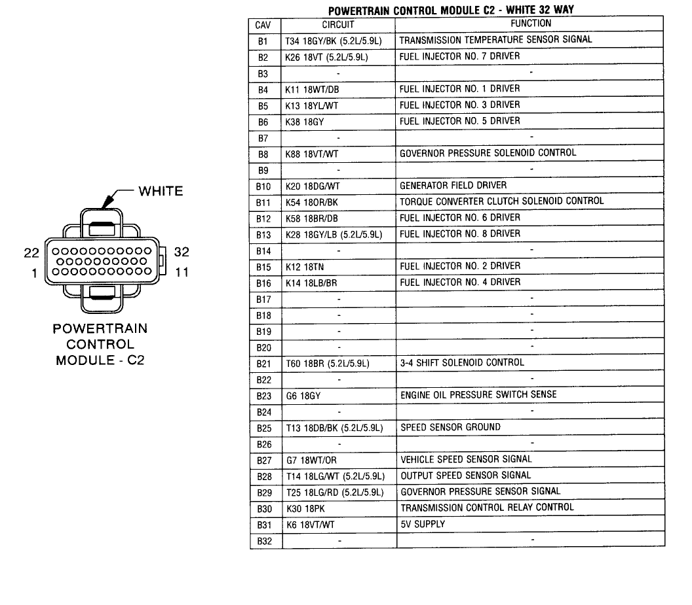

2000 Dodge Ram Van B3500 Maintenance and Repair

August 2025, problem is like [this guy's](https://dodgeforum.com/forum/dodge-ram-van/443024-2000-ram-van-3500-crank-but-won-t-start.html).

Wiring diagram of PCM (computer), with C1 to the right as you're looking at it
from the front of the van:

